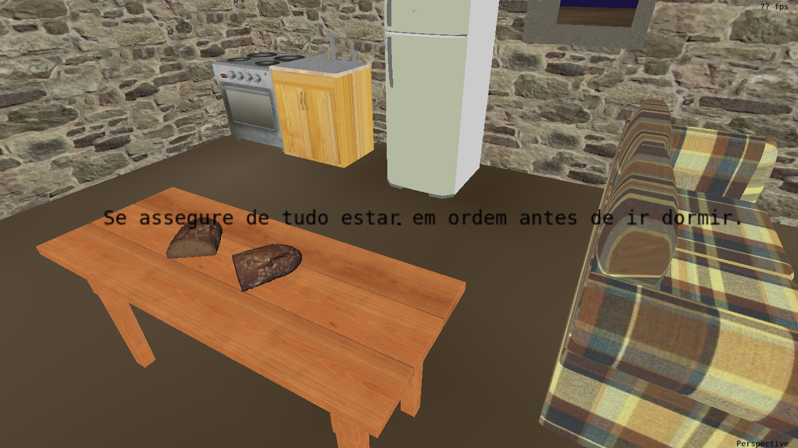
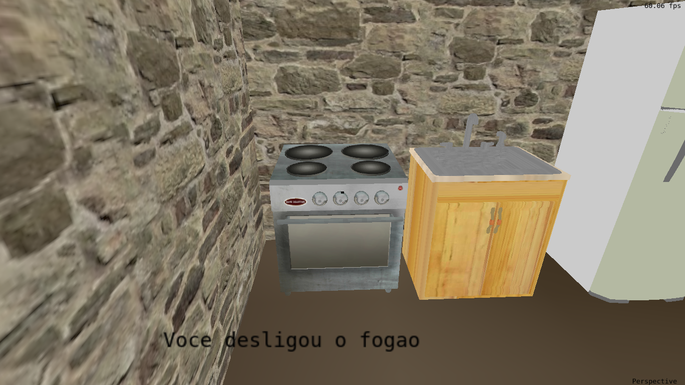
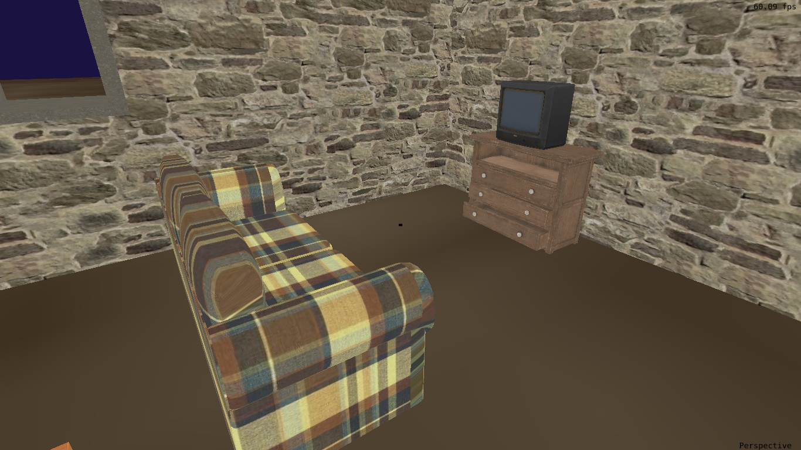
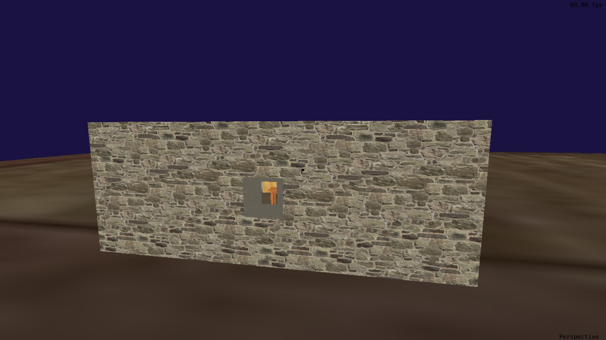
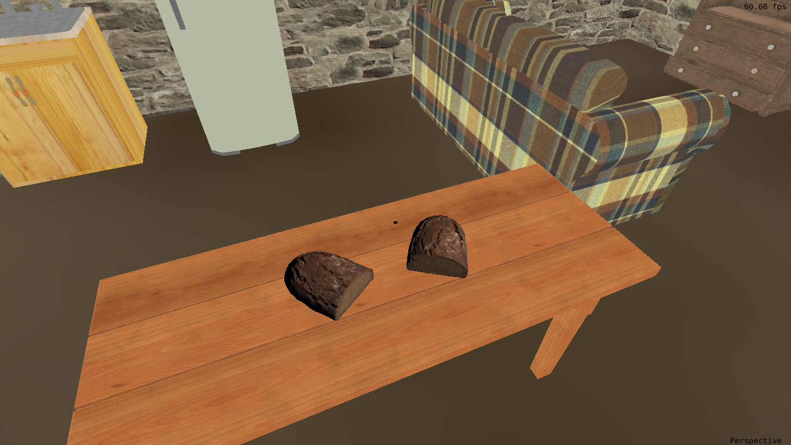
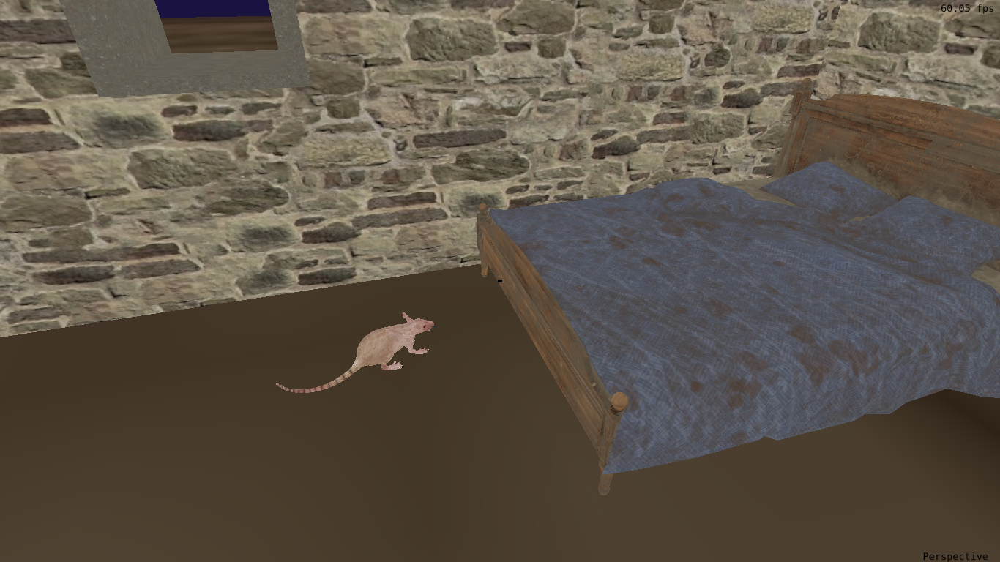
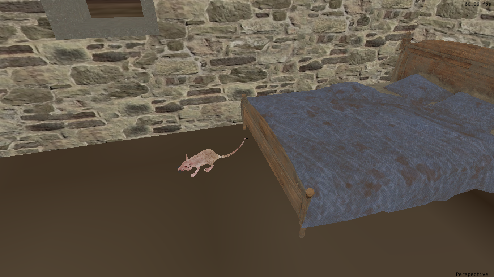
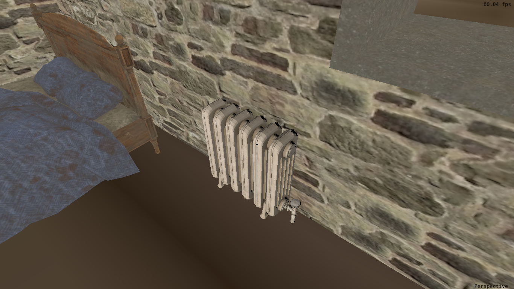
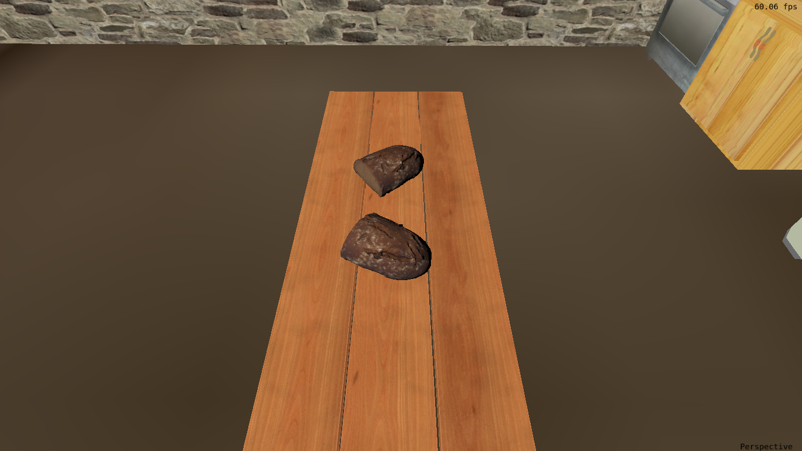
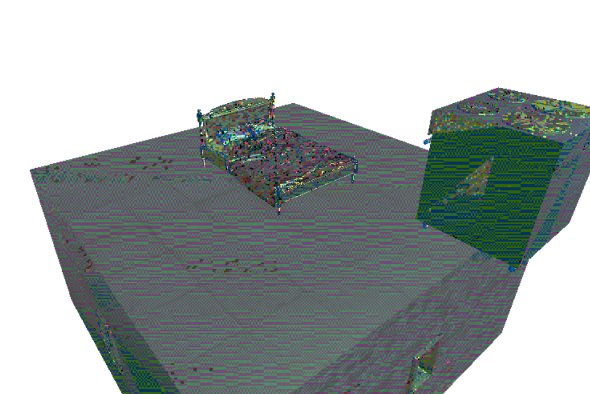

# Durma Tranquilamente

Foi desenvolvido pela dupla um jogo baseado no formato _Escape Room_, no qual o jogador permanece em uma casa e deve interagir com os móveis e objetos do ambiente, descobrindo uma sequência oculta de ações que deve realizar antes de deitar para dormir. O objetivo do jogo é dormir em segurança, sem que uma morte ocorra. 



## Como Executar

## Como Jogar

## Aplicação dos Conhecimentos de Computação Gráfica

O código segue a estrutura dos laboratórios práticos realizados ao longo da disciplina. A seguir, será detalhado o processo de desenvolvimento e o uso de conceitos de Computação Gráfica estudados na disciplina, assim como os requisitos do jogo que foram implementados.

### Malhas Poligonais Complexas e Mapeamento de Texturas

O jogo possui um total de 15 objetos de complexidades variadas. Os modelos 3D dos objetos foram obtidos do site [Rig Models](https://rigmodels.com/index.php). Cada modelo possui um arquivo .obj, um arquivo .mtl e uma ou mais imagens de textura. 

Para obter as informações dos arquivos foi utilizada a mesma função de leitura dos laboratórios 4 e 5, porém para enviar as informações para os _shaders_ foi necessário adaptar a função de desenho, pois era necessário informar para cada objeto, qual era sua imagem de textura. Também foi utilizada uma terceira função que relaciona cada objeto com sua respectiva imagem de textura, para facilitar a passagem dessa informação para os _shaders_ na função de desenho. 



Todos objetos do jogo têm sua cor definida a partir de uma textura e já vieram com as coordenadas de textura definidas no arquivo .obj. Alguns objetos, além da cor oriunda da textura, também possuem cálculo de iluminação. Os modelos de iluminação utilizados estão descritos a seguir. 

Para o carregamento dos objetos e das texturas foram utilizados conhecimentos adiquiridos durante a realização dos laboratórios 4 e 5. Esses conhecimentos também foram extendidos, uma vez que os objetos do jogo, diferente dos objetos dos laboratórios, possuiam informações em arquivo .mtl.

### Transformações Geométricas Controladas pelo Usuário

O jogador tem a possibilidade de rotacionar os pães em cima da mesa, um no sentido horário e outro no sentido anti-horário, ao mesmo tempo. Para tal, o jogador deve interagir com a mesa, apertando a tecla _E_. A rotação é feita através de uma rotação em torno do eixo Y por uma variável que incrementa 0.5 a cada nova interação com a mesa.
```cpp
  if (rotate_breads)
  {
      bread_rotation = bread_rotation + 0.5f;
      rotate_breads = false;
  }

// ... código entre dos dois trechos ...

  bread1_model_matrix =
      Matrix_Translate(bread1_position.x, bread1_position.y, bread1_position.z) *
      Matrix_Rotate_Y(bread_rotation) *
      Matrix_Scale(bread1_scale, bread1_scale, bread1_scale);

  bread2_model_matrix =
      Matrix_Translate(bread2_position.x, bread2_position.y, bread2_position.z) *
      Matrix_Rotate_Y(-bread_rotation) *
      Matrix_Scale(bread2_scale, bread2_scale, bread2_scale);
``` 

### Câmera Livre e Câmera Look At

O jogo desenvolvido possui os dois tipos de câmera: câmera livre e câmera look at. Ao iniciar o jogo, o jogador está dentro da casa e tem uma visão obtida através da câmera livre, podendo se movimentar pelo cômodo utilizando o teclado e o mouse. 



Para a implementação da câmera livre, utilizamos 3 parâmetros do jogador: o vetor _up_, que mantém o jogador sempre "no solo", sendo um vetor unitário no eixo Y; o vetor _front_ que determina a direção da câmera; e _position_, um vetor que determina a posição atual do jogador. Para sua movimentação, foram escolhidas as teclas padrão *WASD* para possibilitar andar nas 4 direções. Já a rotação da câmera se dá a partir de um cálculo da movimentação do mouse, que pode ser visto em detalhes na função *CursorPosCallback*. 

O jogador também tem a possibilidade de apertar a tecla _c_ e mudar o tipo de câmera virtual de câmera livre para câmera look at. Quando o jogador altera o tipo de câmera ele vai para o exterior da casa.



Quando a tecla é pressionada e a flag _useLookAt_ é ativada, a posição da câmera é calculada em coordenadas esféricas. As variáveis *g_CameraPhi*, *g_CameraTheta*, *g_CameraDistance* definem sua posição. A câmera está fixadamente olhando para a origem do sistema de coordenadas, onde está centrada a casa do jogo. Quando o botão esquerdo do mouse é pressionado, o movimento do cursor atualiza os ângulos *g_CameraTheta* e *g_CameraPhi*, fazendo a câmera orbitar ao redor da casa. Também é possível se aproximar ou se afastar da casa usando _scroll_ do mouse.

A câmera look at foi implementada da mesma maneira vista no laboratório 2, com uma única diferença. O jogo não poderia permitir que o jogador orbitasse livremente pela casa e visualizasse seu interior por baixo. Para evitar isso, o ângulo *g_CameraPhi* foi limitado na função _CursorPosCallback()_. Se ele for menor que 0.01, ele é fixado em 0.01. Assim a sensação é que a câmera virtual "bate no chão".

### Mais de uma Instância para Algum Objeto

O objeto BREAD que está localizado em cima da mesa tem duas intâncias. As informações dos arquivos .obj e .mtl são obtidas apenas uma vez. Foram definidas duas matrizes de transformação geométrica, cada uma translada o objeto diferentemente. A rotação dos objetos também é uma diferença entre essas matrizes. A função de desenho foi chamada duas vezes para esse objeto, cada uma utilizando uma matriz de transformação geométrica diferente. Ambas instâncias foram associadas ao mesmo *object_id* para o *shader*.

```cpp
float bread1_scale = 0.5f;
glm::vec3 bread1_position = glm::vec3(4.0f, -4.5f, -5.0f);
glm::mat4 bread1_model_matrix = Matrix_Translate(bread1_position.x, bread1_position.y, bread1_position.z) 
                                * Matrix_Scale(bread1_scale, bread1_scale, bread1_scale) * Matrix_Rotate_Y(0.60f);

float bread2_scale = 0.5f;
glm::vec3 bread2_position = glm::vec3(4.0f, -4.5f, -3.0f);
glm::mat4 bread2_model_matrix = Matrix_Translate(bread2_position.x, bread2_position.y, bread2_position.z) 
                                * Matrix_Scale(bread2_scale, bread2_scale, bread2_scale) * Matrix_Rotate_Y(-0.60f);

// ... código entre dos dois trechos ...

glActiveTexture(GL_TEXTURE0);
glUniformMatrix4fv(g_model_uniform, 1, GL_FALSE, glm::value_ptr(bread1_model_matrix));
DrawVirtualObjectWithMtl(&breadmodel, bread_textures, BREAD);

glActiveTexture(GL_TEXTURE0);
glUniformMatrix4fv(g_model_uniform, 1, GL_FALSE, glm::value_ptr(bread2_model_matrix));
DrawVirtualObjectWithMtl(&breadmodel, bread_textures, BREAD);
```



### Tipos de Testes de Intersecção

Para as colisões, utilizamos Bboxes para todos os objetos, com exceção das paredes que são planos com suas normais apontadas para dentro do cômodo. Para os testes, vericamos se o objeto móvel(o rato ou o jogador - esfera ou cubo AABB) irá, na posição seguinte, colidir com algum objeto da cena. Se o retorno dessa verificação for _true_, houve colisão e portanto proibimos a movimentação. Para o jogador, simplesmente o impedimos de seguir naquela direção. Para o rato, invertemos o _sentido_ da locomoção. Caso nenhuma colisão seja detectada, computamos a nova posição do objeto móvel. As funções de teste utilizadas podem ser encontradas no arquivo **collisions.cpp**, que conta com as 4 funções de teste abaixo:
```cpp
bool TestAABBvsAABB(const AABB &a, const AABB &b);
bool TestAABBvsSphere(const AABB &box, const Sphere &sphere);
bool TestAABBvsPlane(const AABB &box, const Plane &plane);
bool TestSphereVsPlane(const Sphere &sphere, const Plane &plane);
``` 





### Modelos de Iluminação e Modelos de Interpolação

Há dois objetos que tem sua cor calculada utilizando um modelo de iluminação: BREAD e RADIATOR. O _fragment shader_ utiliza o *object_id* para diferenciar os diferentes objetos presentes no jogo. Para BREAD a cor é calculada usando o modelo de iluminação Blinn-Phong. Para RADIATOR a cor é calculada usando o modelo de iluminação de Lambert (Difusa).

Para calcular a cor final usando o modelo de iluminação de Lambert, foi multiplicada a cor difusa obtida através da textura multiplicada por um vetor (0.9, 0.9, 0.9) para ajuste do brilho e pelo termo de iluminação _lambert_. Esse termo foi calculado a partir do produto vetorial entre a normal da superfície e a fonte de luz. O termo lambert garante que as superfícies não voltadas para luz não recebam iluminação, pois o resultado do produto vetorial indica o quanto a luz incide na superfície.



A cor final usando modelo de iluminação Blinn-Phong é obtida através da soma de três componentes distintas: difusa, ambiente e especular. A componente difusa é determinada pela cor da imagem de textura do objeto . A componente ambiente é obtida através da multiplicação do coeficiente Ka por uma luz ambiente global, garantindo que as áreas em sombra não fiquem totalmente escuras e recebam uma tonalidade de base, como podemos ver na imagem abaixo. Por fim, a componente especular adiciona um ponto de brilho na superfície. A soma dessas três componentes resulta na aparência final do material, com cor, sombreamento, e realces de brilho.



O cálculo dos modelos de iluminação segue o que foi aprendido nas aulas e na realização do laboratório 4. Como mencionado, todos objetos que possuem cálculo de iluminação tem esse cálculo realizado no _fragment shader_, o que caracteriza um modelo de interpolação Phong. O jogo não possui nenhum objeto com iluminação calculada usando modelo de interpolação Gouraud. A princípio, este é o único requisito não desenvolvido pela dupla.

### Movimentação com Curva de Bézier Cúbica

Para a curva, os pontos escolhidos foram os abaixo:
```cpp
glm::vec3 p0 = glm::vec3(-18.0f, -8.0f, -18.0f);
glm::vec3 p1 = glm::vec3(18.0f, -8.0f, -18.0f);
glm::vec3 p2 = glm::vec3(18.0f, -8.0f, 18.0f);
glm::vec3 p3 = glm::vec3(-18.0f, -8.0f, 18.0f);
```
As suas funções são _CalculateBezierPoint_ e _CalculateBezierTangent_. A primeira faz o cálculo da curva para um determinado ponto `P = (1-t)**3 * P0 + t*P1*(3*(1-t)**2) + P2*(3*(1-t)*t**2) + P3*t**3`. Já a segunda calcula sua tangente, de forma que conseguimos obter a direção correta para qual o rato deve olhar em um determinado instante.

## Animações Baseadas em Tempo

Para implementar as animações baseadas em tempo, obtemos o tempo atual de um frame através da função _glfwGetTime()_. Calculamos então a diferença entre o tempo atual e o último tempo computado. Essa diferença é então multiplicada nas posições do rato e do jogador, que são os únicos objetos animados, garantindo que suas locomoções não fiquem lentas. Abaixo foram selecionadas as 2 linhas de código que implementam essa multiplicação:
```cpp
rat.t += rat.direction * rat.speed * time_diff;
player.position + movements[i] * camera_speed * time_diff;
``` 

## Contribuições

### Aline

- Leitura de arquivos .obj e .mtl
- Pesquisa por modelos 3D compatíveis com as funções de leitura e desenho
- Desenho dos objetos
- Posicionamento dos objetos na cena virtual por meio de transformações geométricas
- Mapeamento de texturas
- Modelos de iluminação Lambert e Blinn-Phong
- Modelo de interpolação Phong
- Câmera look at
- Lógica para troca entre câmeras

### Mariana

- Câmera livre
- Intersecções de objetos de formatos distintos
- Animação baseada em tempo
- Transformação geométrica de um objeto
- Um objeto se locomovendo em uma curva de Bézier
- Lógica de interação do rato com o mundo
- Lógica de interação do jogador com o mundo
- Jogabilidade geral, como as consequências das interações do jogador com os objetos.

## Uso de Inteligência Artificial

Ao longo do desenvolvimento do jogo a dupla fez uso do ChatGPT e do Gemini. Os principais usos foram para entender como algo que estava fora do conhecimento da dupla poderia ser feito e encontrar a fonte de erros. Há trechos do código que são adaptações de códigos gerados por inteligência artificial, o que permitiu que a dupla solucionasse problemas encontrados, os quais a dupla não tinha conhecimento para resolver. Em um caso específico, detalhado a seguir, mesmo com o uso de inteligênca artificial não foi possível resolver o problema. 

A dupla encontrou bastante dificuldade para ler as informações de modelos 3D que possuiam tanto arquivos .obj quanto arquivos .mtl e passar essas informações para os _shaders_. Foi utilizada inteligência artificial primeiramente para entender a estrutura desses arquivos e como eles se relacionavam. Posteriormente, para encontrar maneiras de passar essas informações de forma correta para os _shaders_. A dupla conseguiu passar as informações de textura (imagens de textura) para os _shaders_ utilizando o arquivo .mtl, porém não conseguiu passar corretamente as informações de iluminação (coeficientes) que também estavam definidos no arquivo. Os coeficientes de iluminação foram adicionados manualmente no _fragment shader_.

Um exemplo de uso dessas ferramentas para encontrar fonte de erros foi quando, ao tentar renderizar os objetos do jogo, a dupla se deparou com o erro da imagem a seguir. Utilizando essas ferramentas para entender as possíveis fontes do erro, identificamos que estava sendo enviado para função que relaciona as texturas com cada objeto o caminho errado da localização das imagens.



A dupla também utilizou IAs para conseguir renderizar corretamente o quadrado preto central na tela. A dificuldade principal era encontrar uma maneira fácil de fazer isso. A sugestão das IAs de criar arquivos de *vertex* e *fragment* foi a solução implementada no projeto final.
